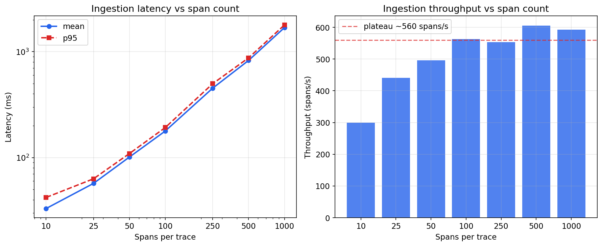
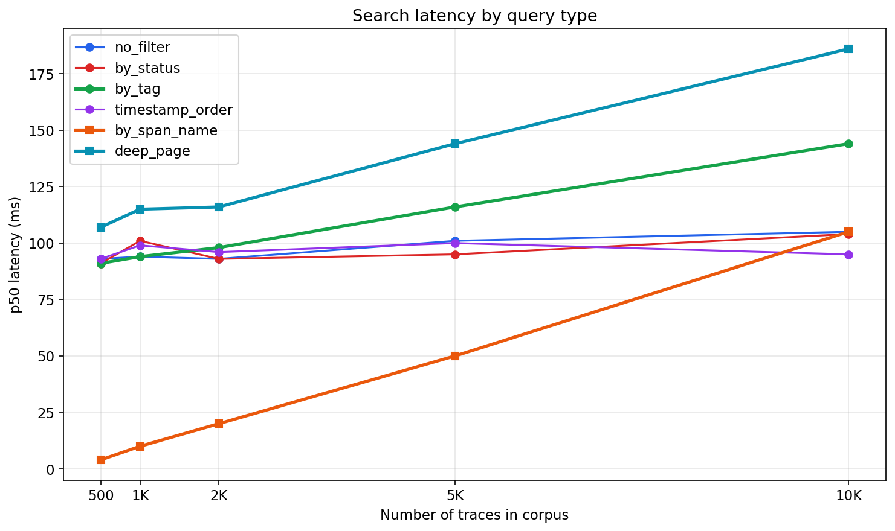
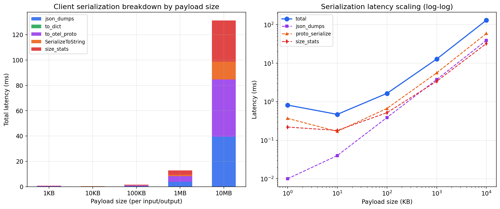
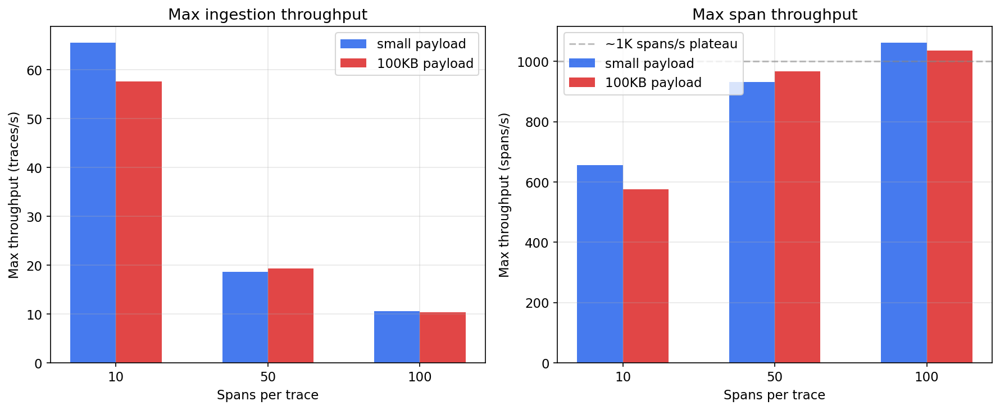
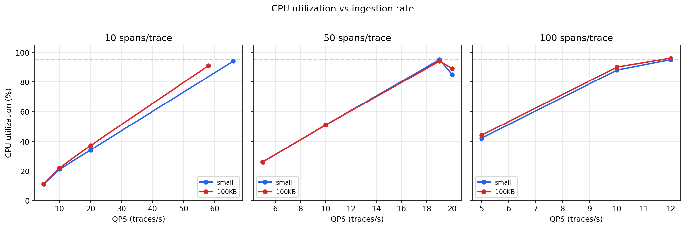
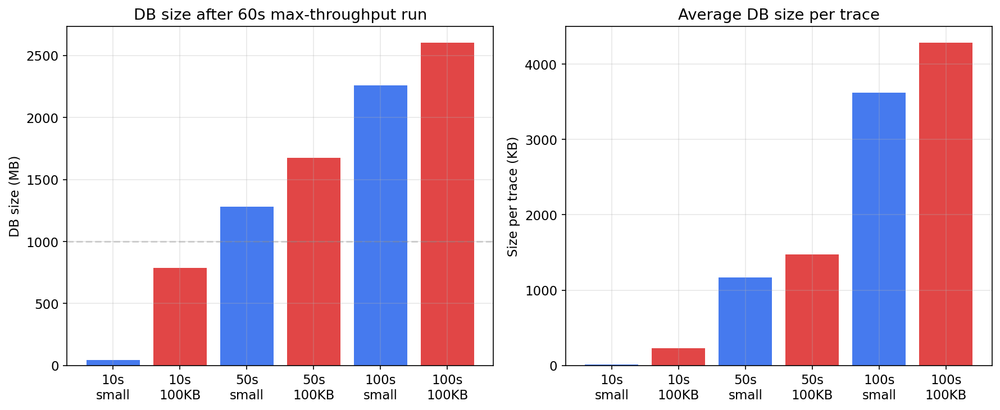
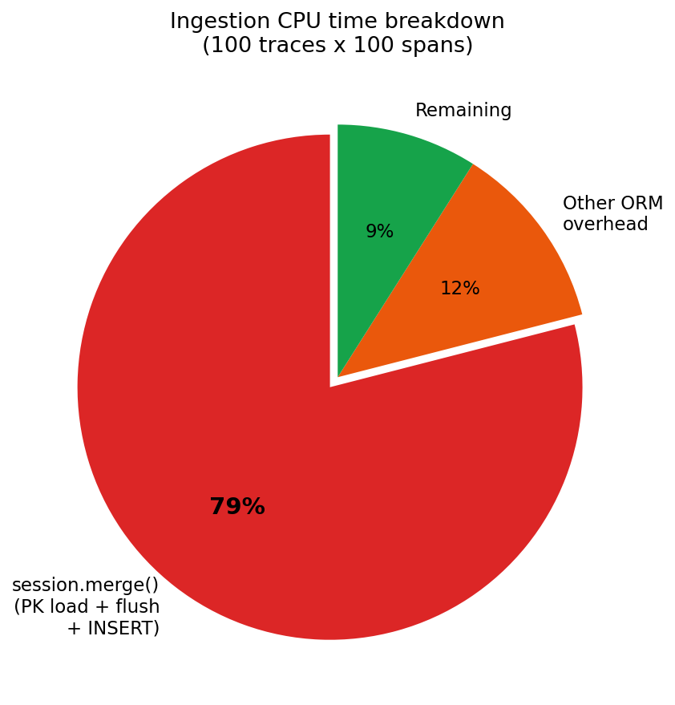

# Trace Performance Analysis

**Problem:** Users report noticeable overhead from tracing and slow trace search. We lack benchmarks to quantify performance or identify bottlenecks, which is a growing risk as products like Gateway depend more on tracing.

**Why now:** No existing performance baselines exist. We're flying blind on regressions.

## Methodology

### Server-side (storage layer)

- **What's measured:** `SqlAlchemyStore` Python methods directly - no HTTP server, no network overhead. This isolates the storage layer.
- **Database:** SQLite in a temporary directory, fresh per run. Results may differ on PostgreSQL / MySQL.
- **Test data:** Synthetic traces with realistic span distributions (30% LLM, 20% retriever, 15% tool, etc.). LLM spans include token usage, cost, and model attributes. Each trace has tags (`env`, `model`) for filter benchmarks.
- **Ingestion:** Each iteration calls `start_trace()` + `log_spans()` for one trace. Data is pre-generated before measurement so timing reflects only the store path.
- **Search queries:**
  - `no_filter` - `search_traces()` with `max_results=100`, no filter
  - `by_status` - filter `status = 'OK'` (indexed column)
  - `by_tag` - filter `tag.env = 'prod'` (tag table join)
  - `timestamp_order` - order by `timestamp DESC`
  - `by_span_name` - filter `span.name = 'llm_0'` (RLIKE on JSON `content`)
  - `deep_page` - paginate to page 10 with `max_results=10`
- **Timing:** `time.perf_counter()` per iteration. GC disabled during measurement. 3 warmup iterations, then 10 measured iterations (ingestion) or 30 measured iterations (search).
- **Memory:** `tracemalloc` for Python allocations, `resource.getrusage` for peak RSS delta.
- **Profiling:** cProfile on 100 traces x 100 spans ingestion, analyzed with `snakeviz`.

### Client-side (serialization pipeline)

- **What's measured:** The full client-side serialization path that spans travel through before hitting the network - from `dump_span_attribute_value()` through protobuf encoding. No HTTP calls, no server involvement.
- **Test data:** Synthetic LLM-style chat payloads (lists of `{"role": ..., "content": ...}` messages) at 1KB, 10KB, 100KB, 1MB, and 10MB per input/output. 10 spans per trace with the root span carrying the large payload.
- **Pipeline steps measured independently:**
  1. `dump_span_attribute_value()` - JSON serialization via `TraceJSONEncoder`
  2. `Span.to_dict()` - span to Python dict conversion
  3. `Span.to_otel_proto()` - span to OTel protobuf message
  4. `ExportTraceServiceRequest.SerializeToString()` - full protobuf request build + byte serialization
  5. `add_size_stats_to_trace_metadata()` - re-serializes all spans to JSON to compute byte sizes
- **Timing:** `time.perf_counter()` per iteration. GC disabled. 2 warmup, 10 measured iterations.
- **Profiling:** cProfile on 50 iterations of the full pipeline at 10MB payload size.

## Benchmark Results (SQLite, local)

### Ingestion

| spans/trace | mean (ms) | p95 (ms) | traces/s | spans/s |
| ----------- | --------- | -------- | -------- | ------- |
| 10          | 33        | 42       | 30.0     | 300     |
| 25          | 57        | 63       | 17.6     | 441     |
| 50          | 101       | 109      | 9.9      | 496     |
| 100         | 178       | 192      | 5.6      | 563     |
| 250         | 452       | 498      | 2.2      | 553     |
| 500         | 826       | 874      | 1.2      | 606     |
| 1,000       | 1,686     | 1,784    | 0.6      | 593     |

Ingestion scales linearly with span count (~1.7 ms per span). Throughput ramps from ~300 spans/s at small traces to a plateau around 550–600 spans/s at 100+ spans/trace.



### Search (p50 latency in ms)

| query           | 500 traces | 1K traces | 2K traces | 5K traces | 10K traces |
| --------------- | ---------- | --------- | --------- | --------- | ---------- |
| no_filter       | 93         | 94        | 93        | 101       | 105        |
| by_status       | 91         | 101       | 93        | 95        | 104        |
| by_tag          | 91         | 94        | 98        | 116       | 144        |
| timestamp_order | 93         | 99        | 96        | 100       | 95         |
| by_span_name    | 4          | 10        | 20        | 50        | 105        |
| deep_page       | 107        | 115       | 116       | 144       | 186        |

Key observations:

- **`by_span_name`** scales linearly: 4 ms -> 105 ms from 500 to 10K traces (~26x), because it uses RLIKE on the unindexed JSON `content` column.
- **`deep_page`** grows steadily: 107 ms -> 186 ms (~74%), reflecting offset-based pagination overhead.
- **`by_tag`** shows moderate degradation: 91 ms -> 144 ms (~58%), as tag filtering requires joining and scanning the tags table.
- **`no_filter`**, **`by_status`**, **`timestamp_order`** remain relatively flat (~90–105 ms), which strongly suggests the N+1 lazy loading cost is dominating these queries more than the base search SQL itself.



### Resource Usage

- **DB size:** 217 MB for ~18.5K traces (~12 KB/trace average)
- **Memory:** Peak RSS delta ~1.7 MB, tracemalloc peak ~2 MB - memory is not a concern

### Client-side serialization (10 spans/trace)

| payload | input KB | output KB | proto KB | json_dumps (ms) | to_dict (ms) | to_proto (ms) | proto_ser (ms) | size_stats (ms) |
| ------- | -------: | --------: | -------: | --------------: | -----------: | ------------: | -------------: | --------------: |
| 1KB     |      1.1 |       1.1 |      4.6 |            0.01 |         0.22 |          0.39 |           0.37 |            0.22 |
| 10KB    |      9.9 |       9.9 |     22.3 |            0.04 |         0.08 |          0.15 |           0.17 |            0.18 |
| 100KB   |     97.9 |      97.9 |    199.5 |            0.39 |         0.07 |          0.52 |           0.67 |            0.52 |
| 1MB     |    978.4 |     978.4 |   1971.4 |            3.77 |         0.07 |          4.56 |           5.61 |            3.40 |
| 10MB    |   9782.9 |    9783.0 |  19689.1 |           39.34 |         0.07 |         45.17 |          59.24 |           32.53 |

Key observations:

- **Scaling is linear** with payload size across all steps. Every 10x increase in payload size yields roughly 10x increase in latency.
- **`to_dict()` is essentially free** (~0.07 ms regardless of size) because it just reads pre-serialized JSON strings from OTel span attributes - no re-serialization.
- **`proto_serialize`** is the single most expensive step (59 ms at 10MB) because it includes both `to_otel_proto()` conversion and final `SerializeToString()`.
- **`size_stats`** adds 33 ms at 10MB by re-serializing every span to JSON just to measure byte sizes - redundant work on the hot path.
- **Data doubles in protobuf** - 10MB input + 10MB output → 19.7MB protobuf, because JSON string attributes are stored verbatim inside the proto envelope.
- **Total client-side overhead at 10MB: ~180 ms** (json_dumps + to_proto + proto_ser + size_stats), before any network I/O.



### Sustained load (SQLite, single writer, 60s per config)

#### Max throughput

| spans/trace | payload | max QPS | spans/s | p50 (ms) | p95 (ms) | CPU % | DB (MB) |
| ----------: | ------: | ------: | ------: | -------: | -------: | ----: | ------: |
|          10 |   small |    65.6 |     656 |       15 |       19 |   94% |      46 |
|          10 |   100KB |    57.6 |     576 |       17 |       21 |   91% |     786 |
|          50 |   small |    18.6 |     932 |       53 |       62 |   95% |   1,280 |
|          50 |   100KB |    19.3 |     967 |       51 |       60 |   94% |   1,674 |
|         100 |   small |    10.6 |   1,063 |       93 |      110 |   94% |   2,258 |
|         100 |   100KB |    10.4 |   1,036 |       96 |      110 |   95% |   2,604 |



#### Latency and CPU at target rates

| spans | payload | target | achieved QPS | p50 (ms) | p99 (ms) | CPU % | headroom |
| ----: | ------: | -----: | -----------: | -------: | -------: | ----: | -------: |
|    10 |   small |      5 |          5.0 |       22 |       37 |   11% |      92% |
|    10 |   small |     10 |         10.0 |       22 |       34 |   21% |      85% |
|    10 |   small |     20 |         20.0 |       19 |       26 |   34% |      69% |
|    50 |   small |      5 |          5.0 |       54 |       74 |   26% |      73% |
|    50 |   small |     10 |         10.0 |       54 |       72 |   51% |      46% |
|    50 |   small |     20 |         20.0 |       45 |       58 |   85% |      -7% |
|   100 |   small |      5 |          5.0 |       89 |      116 |   42% |      53% |
|   100 |   small |     10 |         10.0 |       92 |      116 |   88% |       6% |
|   100 |   small |     20 |         11.8 |       84 |      107 |   95% |  **SAT** |
|   100 |   100KB |     20 |         11.9 |       83 |      102 |   96% |  **SAT** |

Key observations:

- **Span count dominates throughput**, not payload size. 10 spans: ~66 QPS. 50 spans: ~19 QPS. 100 spans: ~11 QPS. This directly reflects the per-span `session.merge()` cost.
- **Payload size barely matters** for the storage layer. 100KB payloads only reduce max QPS by ~12% at 10 spans (65.6 → 57.6) and have negligible impact at 50–100 spans. The ORM overhead dwarfs serialization cost.
- **CPU is pegged at 94–96%** at max throughput regardless of configuration — the bottleneck is CPU-bound ORM work, not I/O.
- **DB size scales with payload**: 100KB payloads produce ~17x larger DBs than small payloads at 10 spans (786 MB vs 46 MB for ~3.5K traces).
- **Saturation is sharp**: at 100 spans, 10 QPS uses 88% CPU with only 6% headroom. Target 20 QPS is fully saturated (achieved only 11.8–11.9).
- **Latency stays flat below saturation**: p50 is consistent regardless of target rate until the system saturates, confirming the bottleneck is throughput-limited, not latency-limited.





## Bottlenecks Identified

### 1. Ingestion: `session.merge()` per span (top bottleneck)

[`log_spans()`](https://github.com/mlflow/mlflow/blob/eb00322351e9338d0535c6d64694616bf1ac2ce5/mlflow/store/tracking/sqlalchemy_store.py#L4315) calls `session.merge()` individually for every span and every span metric. A 100-span trace triggers **19K+ merge calls** for 100 ingestions - each one does a PK identity load + autoflush + INSERT.

cProfile of 100 traces x 100 spans (12.8s total):

```
         ncalls  tottime  cumtime  function
            100    0.120   12.681  sqlalchemy_store.py:log_spans
          19459    0.034   10.102  session.py:merge            ← 79% of total
          19459    0.134    5.620  session.py:_merge
          19459    0.146    4.698  session.py:_get_impl        ← PK lookup per merge
          39518    0.012    4.482  session.py:_autoflush       ← flush before every get
          19459    0.134    4.267  loading.py:load_on_pk_identity
          19559    0.035    3.529  unitofwork.py:execute
          19659    0.084    2.429  persistence.py:save_obj     ← INSERT per span
          19659    0.111    1.966  persistence.py:_emit_insert_statements
```

`session.merge()` accounts for **79% of wall time** (10.1s of 12.8s). Each of the 19,459 merge calls does: PK identity load (SELECT) -> autoflush -> INSERT. This directly explains why throughput plateaus at ~550–600 spans/s and scales linearly (33 ms for 10 spans -> 178 ms for 100 -> 1,686 ms for 1,000 spans).



Potential fix: bulk `session.bulk_save_objects()` or `INSERT ... ON CONFLICT` via core instead of ORM merge.

### 2. Ingestion: redundant metadata queries

Three separate queries per [`log_spans()`](https://github.com/mlflow/mlflow/blob/eb00322351e9338d0535c6d64694616bf1ac2ce5/mlflow/store/tracking/sqlalchemy_store.py#L4489-L4554) call for token usage, cost, and session ID metadata - could be a single query with `IN` clause. Per cProfile, these add ~3 round-trips per trace on top of the merge overhead.

### 3. Search: N+1 lazy loading

[`SqlTraceInfo.to_mlflow_entity()`](https://github.com/mlflow/mlflow/blob/eb00322351e9338d0535c6d64694616bf1ac2ce5/mlflow/store/tracking/dbmodels/models.py#L755) lazy-loads tags, metadata, and assessments per trace. For N results this is 3N+1 queries. This is likely why even simple queries (`no_filter`, `by_status`) stay at **~90–105 ms regardless of trace count** (500 to 10K) - the cost is dominated by the 300+ lazy-load round-trips for `max_results=100`, not the actual search query.

Potential fix: add `joinedload()` / `subqueryload()` options to the [`search_traces()`](https://github.com/mlflow/mlflow/blob/eb00322351e9338d0535c6d64694616bf1ac2ce5/mlflow/store/tracking/sqlalchemy_store.py#L3316) query.

### 4. Search: RLIKE on JSON blobs

[Span attribute filtering](https://github.com/mlflow/mlflow/blob/eb00322351e9338d0535c6d64694616bf1ac2ce5/mlflow/store/tracking/sqlalchemy_store.py#L6317) uses regex on the raw `content` column (LONGTEXT JSON). No index can accelerate this - it's a full scan of the spans table within the experiment. `by_span_name` went from **4 ms at 500 traces -> 10 ms -> 20 ms -> 50 ms -> 105 ms at 10K traces (~26x)**, growing linearly with trace count - the worst degradation of any query type.

### 5. Search: offset-based pagination

[Deep pagination](https://github.com/mlflow/mlflow/blob/eb00322351e9338d0535c6d64694616bf1ac2ce5/mlflow/store/tracking/sqlalchemy_store.py#L3369) (page 10+) degrades because the DB must scan and discard all preceding rows. `deep_page` went from **107 ms at 500 traces -> 115 ms -> 116 ms -> 144 ms -> 186 ms at 10K traces (~74%)**. Keyset pagination would be more efficient.

### 6. Client serialization: recursive protobuf attribute conversion

[`_set_otel_proto_anyvalue()`](https://github.com/mlflow/mlflow/blob/eb00322351e9338d0535c6d64694616bf1ac2ce5/mlflow/tracing/utils/otlp.py#L158) recursively walks every key and value in JSON-deserialized span attributes to build protobuf `AnyValue` objects. For a 10MB payload, this generates **2.6 million recursive calls** and accounts for the majority of `to_otel_proto()` time.

cProfile of 50 iterations at 10MB payload (9.4s total):

```
         ncalls  tottime  cumtime  function
      700    0.001    5.326  json.dumps                           ← JSON serialization
2654300    2.305    3.333  otlp.py:_set_otel_proto_anyvalue      ← 35% of total, recursive
   884750    0.559    0.559  CopyFrom (protobuf message copy)
      500    0.006    3.347  span.py:to_otel_proto
       50    0.219    0.219  SerializeToString
       50    0.001    1.635  add_size_stats_to_trace_metadata
```

The recursive per-element conversion is inherently expensive for large nested payloads. Since span attributes are already JSON strings, a potential optimization is to store them as a single `string_value` in the proto rather than recursively decomposing the parsed JSON into nested `AnyValue` / `KeyValueList` structures.

### 7. Client serialization: redundant re-serialization in size stats

[`add_size_stats_to_trace_metadata()`](https://github.com/mlflow/mlflow/blob/eb00322351e9338d0535c6d64694616bf1ac2ce5/mlflow/tracing/utils/__init__.py#L614) calls `json.dumps(span.to_dict())` for every span to compute byte sizes, then serializes an empty `Trace` to measure metadata overhead. This duplicates work already done by `to_otel_proto()` / `SerializeToString()` in the export path and adds **33 ms at 10MB** on the hot path.

Potential fix: compute sizes from the already-serialized protobuf bytes, or track sizes incrementally during attribute serialization rather than re-serializing.

## Validated Summary

- The main conclusions above are supported by the current `SqlAlchemyStore` implementation and client-side profiling.
- **Server-side** confirmed issues:
  - per-span / per-metric `session.merge()` in `log_spans()`
  - lazy loading of tags, metadata, and assessments in `search_traces()`
  - regex / text matching over JSON-backed span content
  - offset-based pagination for deeper pages
- **Client-side** confirmed issues:
  - recursive `_set_otel_proto_anyvalue()` decomposition of JSON attributes into protobuf structures (2.6M calls for 10MB payload)
  - redundant re-serialization of all spans in `add_size_stats_to_trace_metadata()`
  - 2x data expansion in protobuf format (JSON strings stored verbatim inside proto envelope)
- The one claim that should be phrased carefully is simple search latency being definitively "dominated" by lazy loading. The code and query-count benchmarks strongly support that explanation, but it is still an inference from measurement rather than a direct profiler attribution.
- Client-side overhead is only significant for large payloads (>100KB). For typical traces with small inputs/outputs, the client-side pipeline adds <1 ms - the server-side bottlenecks dominate.

## Recommended Next Actions

### Server-side

1. Fix `search_traces()` N+1 loading by eager-loading tags, request metadata, and assessments.
2. Fix the `log_spans()` write path by replacing per-row ORM `merge()` with a bulk / upsert-oriented approach.
3. Collapse the redundant token usage, cost, and session-id metadata reads into a single query.
4. Revisit JSON / regex-based span filtering if span-attribute search needs to scale beyond current bounds.
5. Consider keyset pagination if deep trace browsing becomes a common workload.

### Client-side

6. Remove or defer `add_size_stats_to_trace_metadata()` from the hot export path - compute sizes from the already-serialized protobuf bytes instead of re-serializing every span to JSON.
7. For large payloads, consider storing span attributes as a single JSON `string_value` in the protobuf rather than recursively decomposing into nested `AnyValue` structures. This would eliminate the 2.6M recursive calls for 10MB payloads.

## Should We Run Benchmarks in CI?

- **CI runners are noisy.** GitHub Actions uses shared hardware with variable load. A 20% swing from runner noise is indistinguishable from a real regression at the latencies we're measuring (~10–100 ms).
- **The bottlenecks are structural, not marginal.** `session.merge()` at 79% of wall time and 3N+1 lazy-load queries are algorithmic problems - they won't silently regress.
- **Per-bottleneck scripts give clearer signal.** Running `bench_n_plus_one.py` before and after a fix gives a definitive answer (e.g., 301 queries -> 4 queries) that no amount of CI variance can obscure.

Revisit once the major bottlenecks are fixed and we need to protect against regressions from low baselines - at that point a dedicated runner with stable hardware would make sense.

## Reproducing

```bash
# Full server-side benchmark
uv run python trace_perf/trace_benchmark.py

# Ingestion only with cProfile
uv run python trace_perf/trace_benchmark.py --benchmarks ingest --profile

# Client-side serialization benchmark
uv run python trace_perf/bench_client_serialization.py

# Client-side with cProfile (profiles 10MB case)
uv run python trace_perf/bench_client_serialization.py --profile

# Client-side with more spans
uv run python trace_perf/bench_client_serialization.py --spans 50

# Sustained load benchmark (24 configs x 60s each, ~25 min)
uv run python trace_perf/bench_sustained_load.py

# Sustained load with custom parameters
uv run python trace_perf/bench_sustained_load.py --spans 10,50 --payloads small --qps max,10 --duration 30

# Generate plots
uv run python trace_perf/generate_plots.py

# Visualize profiles
uvx snakeviz trace_benchmark.prof
uvx snakeviz client_serialization.prof
```
